# 🚀 ทดสอบระบบ FutureSkill ด้วย API Automation
Class Project: การออกแบบและพัฒนาระบบทดสอบอัตโนมัติ (Automated API Testing) สำหรับแพลตฟอร์ม FutureSkill โดยครอบคลุมการทดสอบเบื้องต้น ดังนี้

* ตรวจสอบเบื้องต้น (Smoke Check)
* ตรวจสอบระบบจัดการสิทธิ์การเข้าถึง (Authentication)
* ตรวจสอบการจัดการข้อมูลผู้ใช้งาน (User Profile)
* สรุปรายงานผลการทดสอบผ่าน Newman CLI Dashboard

---

## 📌 Project Overview
โครงการนี้จัดทำขึ้นเพื่อทดสอบความถูกต้อง ความเสถียร และประสิทธิภาพของระบบ API บนแพลตฟอร์ม FutureSkill โดยจำลองสถานการณ์การใช้งานจริงของระบบเพื่อให้มั่นใจว่าบริการหลักยังคงทำงานได้อย่างถูกต้อง ดังนี้

* การตรวจสอบหน้าเว็บไซต์ของ futureskill
* การเข้าสู่ระบบ 
* การอัปเดตข้อมูลส่วนตัว 

---

## 🛠️ Tech Stack & Tooling
* **API Test Development:** Postman (GUI)
* **CLI Test Execution:** Newman CLI
* **Reporting Framework:** Newman-reporter-htmlextra
* **Environment Strategy:** Isolated Dynamic Environment Management
* **Version Control:** GitHub & Sourcetree

---

## 📂 Test Suite Structure

```text
FutureSkill Collection
├── 00_Smoke_Check
│   ├── GET Homepage Health Check (200 OK & Content Validation)
│   ├── GET Load Static Assets (Assets Availability)
│   └── GET Check Protected Route Redirection (Security & Route Protection)
├── 01_Auth
│   └── Login Features
│       ├── POST POST Login (Success) (Token Extraction & Auto-Storage)
│       └── POST POST Login (Invalid Password) (403 Forbidden Error Handling)
└── 02_User_Profile
    └── Update Profile
        └── PATCH Update name (Authenticated Profile Modification)
```

---

## 📊 Test Results & Showcase

### 1.Postman Test Suite Execution

#### ผลการรัน Test Cases ทั้งหมดผ่านโปรแกรม Postman ผ่านเกณฑ์การทดสอบ 100% (Passed)

#### 00_Smoke_Check (Homepage Health Check & Protected Route)

* **Homepage Health Checks**

<div align="center">
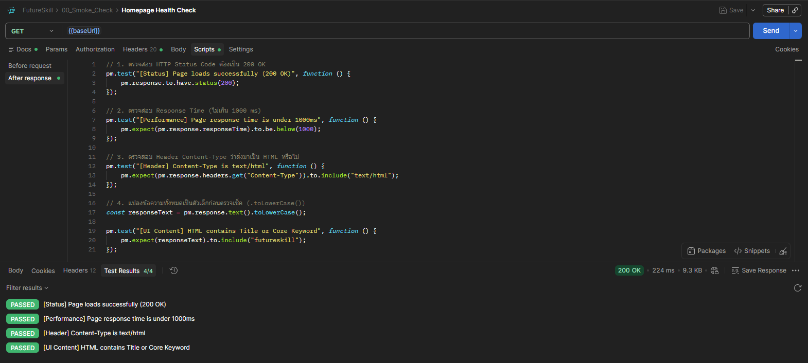
</div>

* **Load Static Assets**

<div align="center">
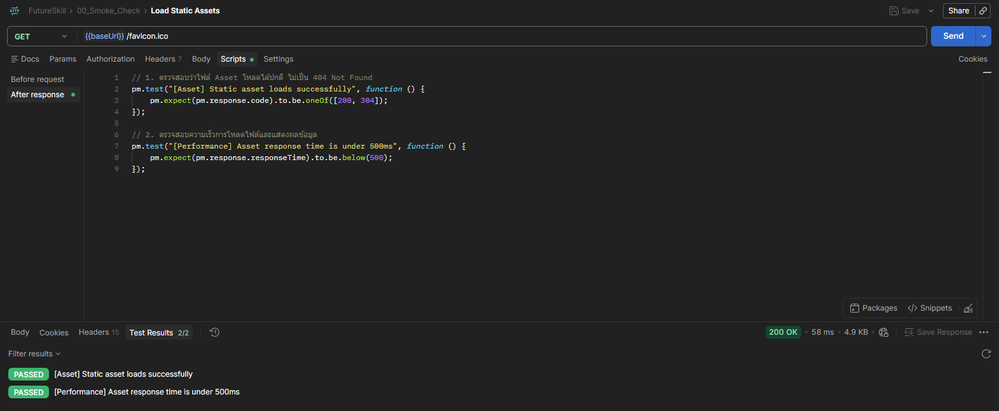
</div>

* **Check Protected Route Redirection**

<div align="center">
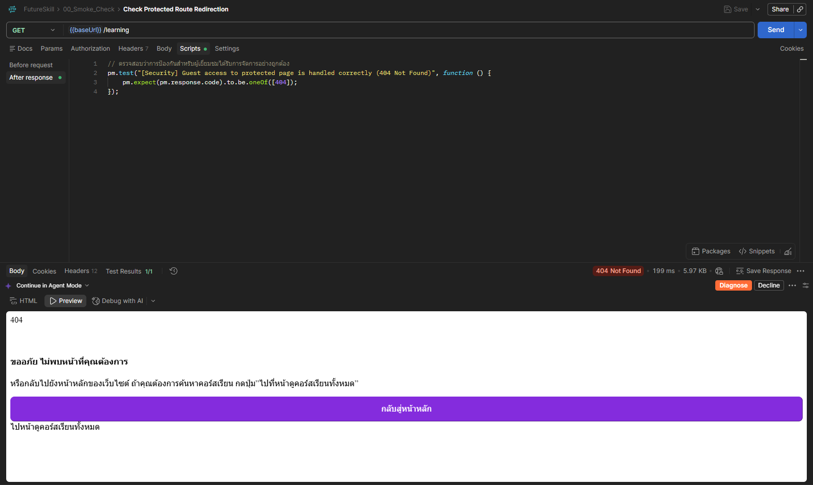
</div>

#### 01_Auth (Login Success & Dynamic Token Handling)

* **POST Login (Success)**

<div align="center">
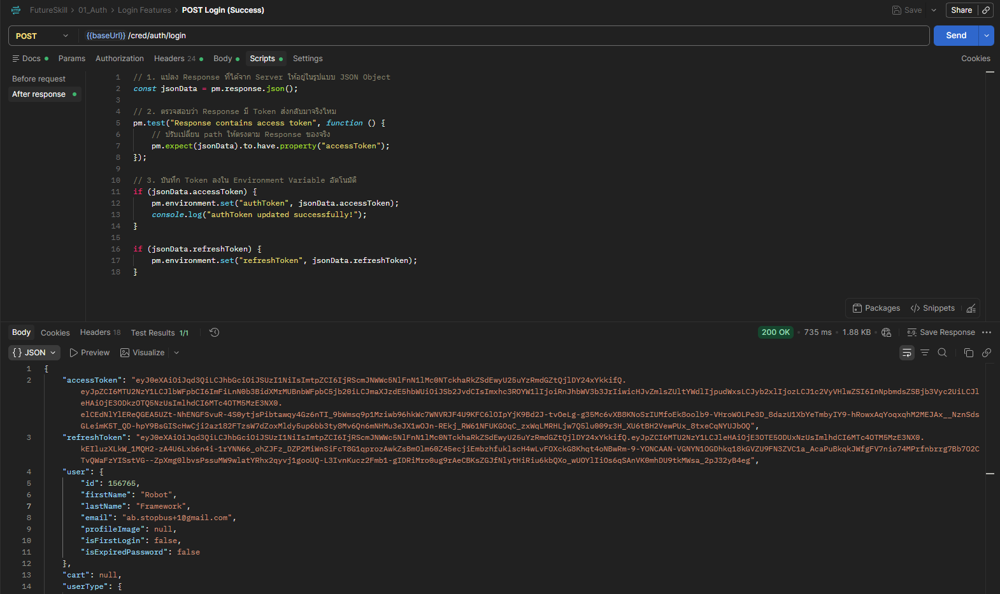
</div>

* **POST Login (Invalid Password)**

<div align="center">
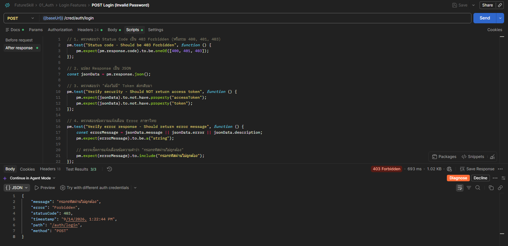
</div>

#### 02_User_Profile (Profile Update with Bearer Token)

* **Update name**

<div align="center">
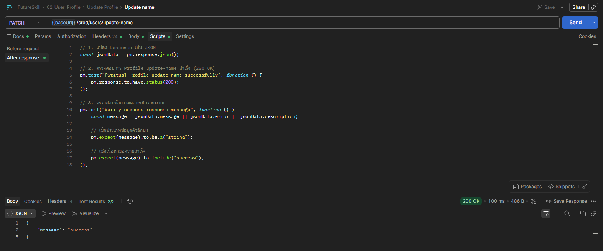
</div>

---

### 2.FutureSkill Run results
ผลการทดสอบ API Requests/Endpoints ทั้งหมด 6 Testcase และตรวจสอบ (Assertions) ทั้งหมด 13 จุด โดยครอบคลุมฟังก์ชันหลักทาง Smoke Check, Anthentication และ User Profile Module

<div align="center">
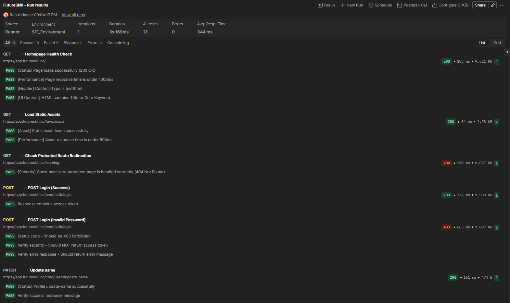
</div>

---

### 3.Newman CLI Automated Report Dashboard
สรุปรายงานผลการทดสอบที่รันผ่าน Newman CLI และสร้าง Dashboard ด้วย htmlextra แสดงความครอบคลุมของการทดสอบ ตรวจสอบค่า Assertions ทั้งหมด 13 จุด และ Total Requests 6 จุด

* **Newman Run Dashboard**

<div align="center">
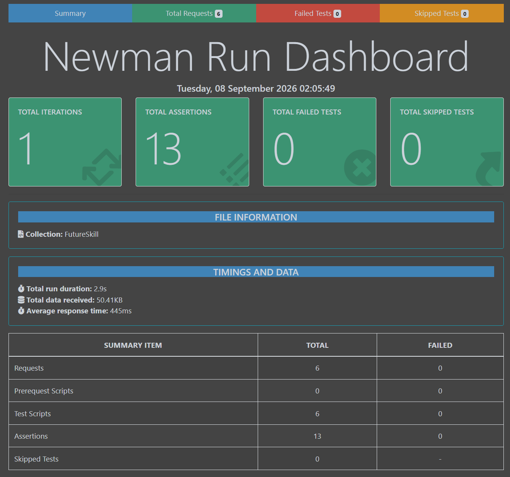
</div>

* **Total Requests**

<div align="center">
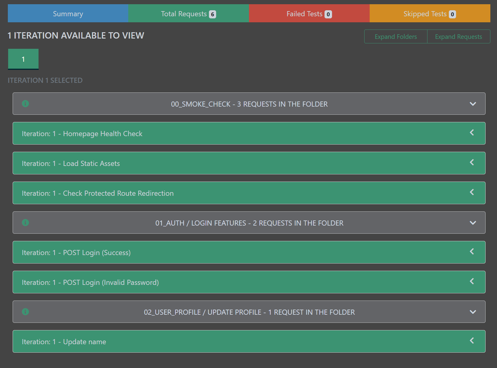
</div>

* **Failed Tests**

<div align="center">
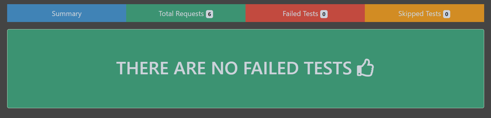
</div>

* **Skipped Tests**

<div align="center">
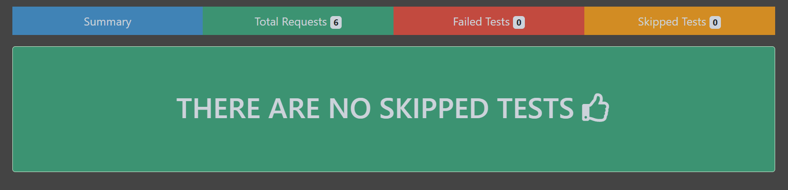
</div>

---

## 🛠️ How to Run Tests Locally

#### ติดตั้ง Node.js และแพ็กเกจ Newman สำหรับรันการทดสอบ

* npm install -g newman
* npm install -g newman-reporter-htmlextra

#### สามารถรันการทดสอบผ่าน CLI พร้อมส่งค่า Environment Variable โดยตรงได้ด้วยคำสั่ง

* newman run FutureSkill.postman_collection.json 
	--env-var "baseUrl=https://app.futureskill.co" 
	--env-var "authToken=YOUR_AUTH_TOKEN" -r htmlextra

---
